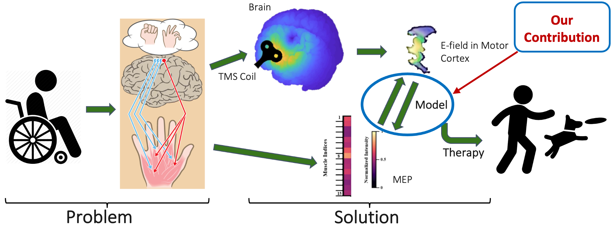
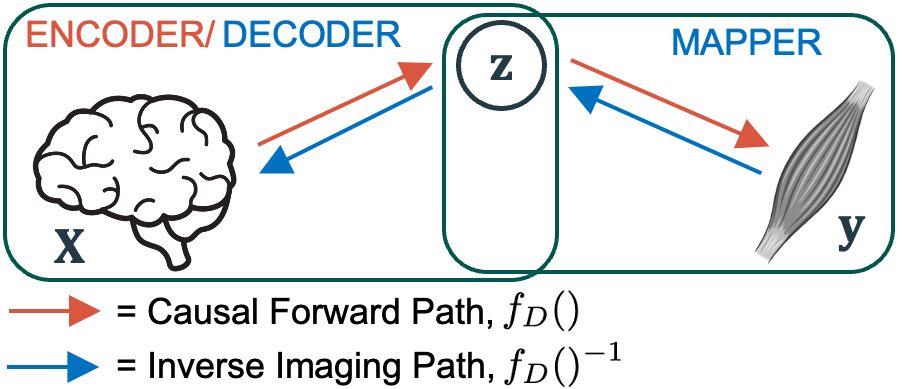

# TMS-EMG Forward and Inverse Regression Modeling

## Project Summary
Overall System: 



Modeling Pipelines: 


<!-- ## Prerequisites
Please install all necessary library versions by typing in terminal:

```pip install -r requirements.txt``` -->

## File Structure
```
|--<data>
|--coding file (e.g. inverse\inverse.py)
```

<!-- ## Usage
Clone this repo, and copy the _\_data_ folder from [here](https://www.dropbox.com/sh/icfard16qqjpqrm/AAA3oMcZpGe1C0HZfqpflVIOa?dl=0) to the root directory [as shown in the file tree above], for all codes to work.

The code runs from terminal using ```main.py```, with supporting functions automatically parsed from ```models.py```, ```helper.py```, and open-sourced functions from the folder ```extra```.

Plots for results can be generated using ```plot_csv.py```

Some residual code snippets and inline results+visualization can be found in ```multimodal_RA.ipynb```

The raw source files can be found in _/SDrive/CSL/\_Archive/2019/DT\_LONI\_Epileptogenesis\_2019_



-->

## Publications
Please take a look at our papers below, for the corresponding coding folders:
1. ```inverse``` [Inverse Model (EMG->TMS: 2022)](https://www.biorxiv.org/content/10.1101/2022.07.22.501062v2.abstract)

Cite: 
```
@article{akbar2022m2minv,
  title={M2M-InvNet: TMS Induced Electric Field Reconstruction from Muscle Responses Using a Convolutional Network and Variational Inference},
  author={Akbar, Md Navid and Yarossi, Mathew and Rampersad, Sumientra and Masoomi, Aria and Tunik, Eugene and Brooks, Dana and Erdogmus, Deniz},
  journal={bioRxiv},
  year={2022}
}
```

2. ```forward``` [Forward Model (TMS->EMG: 2020)](https://dl.acm.org/doi/10.1145/3389189.3389203)

Cite: 
```
@inproceedings{akbar2020m2m,
author = {Akbar, Md Navid and Yarossi, Mathew and Martinez-Gost, Marc and Sommer, Marc A. and Dannhauer, Moritz and Rampersad, Sumientra and Brooks, Dana and Tunik, Eugene and Erdo\u{g}mu\c{s}, Deniz},
title = {Mapping Motor Cortex Stimulation to Muscle Responses: A Deep Neural Network Modeling Approach},
year = {2020},
booktitle = {Proceedings of the 13th ACM International Conference on PErvasive Technologies Related to Assistive Environments},
numpages = {6}
}
```
